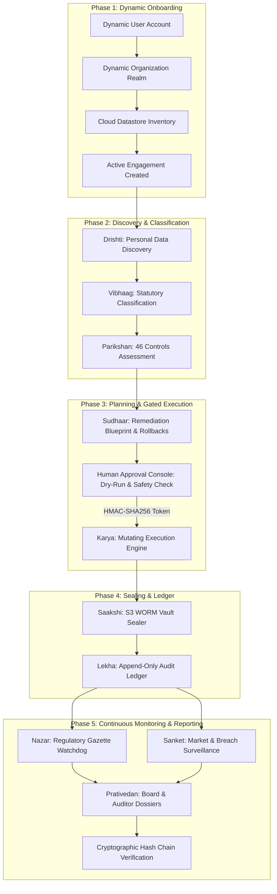

# Axiom Proof — Live Functional Flow Execution Guide

This document describes how to execute and verify the **100% non-hardcoded, end-to-end live functional audit, continuous monitoring, and reporting flow** across all 10 Axiom Proof agents.

---

## 1. Functional Architecture & Agent Flow

The compliance workflow enforces statutory separation of duties (ADR-3) and mandatory human approval gates (BR-2):



---

## 2. Walkthrough Option A: Web Workbench UI (Interactive)

### Step 1: Sign in with a Seeded Compliance User (or Sign Up)

You can log in directly using one of the pre-seeded multi-tenant user accounts:

| Role / Persona              | Email                    | Password            | Tenant / Scope                                   |
| :-------------------------- | :----------------------- | :------------------ | :----------------------------------------------- |
| **Founder / Super Admin**   | `founder@axiomminds.ai`  | `Admin@12345678`    | All Tenants · Role: `owner` (Full scope `{"*"}`) |
| **Fintech Compliance DPO**  | `dpo@meridianpay.com`    | `Meridian@123456`   | Meridian Pay (`...0001`) · Role: `admin`         |
| **Healthcare Lead Auditor** | `auditor@aarogya.in`     | `Aarogya@123456`    | Aarogya Health (`...0002`) · Role: `reviewer`    |
| **SaaS SecOps Lead**        | `security@streamline.io` | `Streamline@123456` | Streamline SaaS (`...0003`) · Role: `approver`   |

1. Navigate to the Web App: `http://localhost:3001/login` (or preprod Cloud Run URL).
2. Enter the credentials for any of the above personas, or click **Sign up** (`http://localhost:3001/login?mode=signup`) to register a new tenant account.
3. Click **Sign in**. The system validates your credentials and redirects to the Compliance Workbench (`/workbench` or `/dashboard`). Note: skip-login bypass is forbidden in all environments.

### Step 2: Onboard your Organization Dynamically

1. Navigate to the Onboarding Wizard: `http://localhost:3001/onboarding` (or click the Tenant Switcher in the top bar and select **+ Onboard New Organization**).
2. Enter your Organization Details:
   - **Legal Name**: e.g., `Apex Sovereign Payments Pvt Ltd`
   - **Slug**: e.g., `apex-payments`
   - **Tier**: `Growth` (or `Enterprise` for Significant Data Fiduciaries)
   - **Statutory Flags**: Toggle _Significant Data Fiduciary (§10)_, _Health Data_, or _Children Data_ as applicable.
3. Configure the resident Data Protection Officer (DPO) details:
   - **DPO Name**: e.g., `Aarav Sen`
   - **DPO Email**: e.g., `dpo@apexpayments.in`
4. Review Initial Data Repositories for Drishti scanning:
   - Primary Transaction Database (PostgreSQL)
   - Customer KYC & Telemetry Vault (S3 Object Lock)
5. Click **Complete Onboarding & Initialize Assessment**.
   - _Under the hood_: Generates unique UUIDs, records a `tenant.created` event into the immutable ledger, binds your account as Tenant Owner, sets your active tenant cookie, and initializes the statutory engagement!

### Step 3: Run the Discovery & Assessment Fleet in Agent Workbench

1. Navigate to **Agent Workbench**: `http://localhost:3001/workbench`.
2. Select **Drishti** and click **Run Agent**.
   - Drishti inventories all personal data stores and checks for domestic ap-south-1 residency.
3. Select **Vibhaag** and click **Run Agent**.
   - Vibhaag tags and classifies fields into Government IDs (Aadhaar, PAN), Financial, and Contact data.
4. Select **Parikshan** and click **Run Agent**.
   - Parikshan evaluates posture against all 46 controls in DPDPA v0.1.0, generating findings in the database.
5. Select **Sudhaar** and click **Run Agent**.
   - Sudhaar proposes actionable remediation plans with strict rollback definitions.

### Step 4: Review and Issue Token in Human Approval Console

1. Navigate to **Approval Console**: `http://localhost:3001/approval` (or `/plans`).
2. Open the active remediation plan (e.g. `PLAN-118`).
3. Verify the **Dry-Run Simulation** results and check the **Validated Snapshot Rollback** reference.
4. Click **Approve Selected Actions**:
   - Prompts for your human approval rationale.
   - Generates a cryptographically signed HMAC-SHA256 scope-bound approval token.
5. In **Execution**: Dispatches **Karya** using the signed token to execute the remediation actions safely.

### Step 5: Seal Proof & Compile Auditor Dossiers

1. In **Evidence Explorer** (`/evidence`): Inspect the artifacts cryptographically sealed by **Saakshi** into the S3 WORM Compliance Vault.
2. In **Continuous Monitoring** (`/monitoring`): Review real-time surveillance by **Nazar** (MeitY gazette notifications) and **Sanket** (incident & breach telemetry).
3. In **Reports** (`/reports`): View the Board Executive Pack and DPB Auditor Dossier compiled by **Prativedan**.
4. In **Audit Ledger** (`/ledger`): Click **Verify Cryptographic Chain** to confirm zero tampering and sequential SHA-256 hash chaining.

---

## 3. Walkthrough Option B: Automated CLI Script (Headless & CI/CD)

The repository provides automated cross-platform runners that execute this entire 13-step flow with dynamically generated accounts, tenants, and systems:

### On Windows 11 (PowerShell):

```powershell
# Run against local staging stack:
.\scripts\run-staging-flow.ps1

# Run against a custom remote or LAN IP:
.\scripts\run-staging-flow.ps1 -BffUrl "http://192.168.1.11:4000" -SupabaseUrl "http://192.168.1.11:55321" -OrgName "Zenith Fiduciary Corp"
```

### On Linux / macOS (Bash):

```bash
# Run against local staging stack:
./scripts/run-staging-flow.sh

# Run against a custom remote or LAN IP:
./scripts/run-staging-flow.sh http://192.168.1.11:4000 http://192.168.1.11:55321 "Zenith Fiduciary Corp"
```

### What the Script Outputs:

1. Dynamically generated Compliance Officer email & password.
2. Dynamically onboarded Tenant UUID and Engagement UUID.
3. Live execution status and latencies for all 10 agents:
   - Drishti (`succeeded`, ~40ms)
   - Vibhaag (`succeeded`)
   - Parikshan (`succeeded`, 46 controls evaluated)
   - Sudhaar (`succeeded`, read-only planning)
   - Approval Console (`HMAC-SHA256 token generated`)
   - Karya (`token-gated simulated execution`)
   - Saakshi (`sealed evidence to S3`)
   - Nazar (`scanned MeitY/DPB gazette`)
   - Sanket (`signal surveillance active`)
   - Prativedan (`Board pack compiled`)
   - Ledger Verification (`intact: true`)
4. Direct clickable URLs to open and review the newly created organization in the Web Workbench.

---

## 4. Continuous Monitoring & Regression Verification

To verify that the staging environment maintains continuous compliance posture:

1. **Regulatory Changes (Nazar)**:
   - Nazar periodically checks MeitY gazette feeds and DPB orders.
   - If a regulatory amendment alters penalty thresholds or notification windows, Nazar links the change to affected control IDs and queues a re-assessment in Parikshan.
2. **Breach Notification Protocol (§8(6))**:
   - Test breach incident workflows at `http://localhost:3001/breaches`.
   - Simulates mandatory 6-hour CERT-In incident notification and 72-hour DPB filing with immutable ledger receipts.
3. **Audit Ledger Proof Verification**:
   - Any compliance officer or external auditor can run:
     ```bash
     curl -s -X POST http://localhost:4000/v1/ledger/verify \
       -H "Authorization: Bearer <JWT>" \
       -H "X-Tenant-Id: <TENANT_UUID>" | jq .
     ```
   - Must return `{"intact": true}`. If any record was altered, the exact sequence number and first break are reported.
